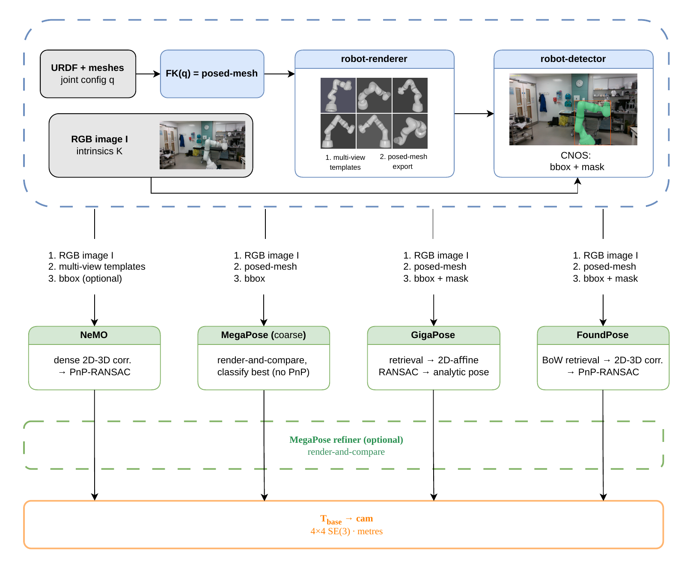

# ROBOP

Robot arm pose estimation from a single RGB image using off-the-shelf BOP pose
estimators, with **no per-robot training, no fiducial markers and no robot motion.**

Given a robot's **known joint configuration** and a query image, ROBOP estimates the camera-to-robot pose. Because the joint configuration is always available when a robot is under computer control, the arm at any fixed configuration is a rigid body with a fully determined 3D geometry, which is exactly the input that BOP models require. This allows BOP models to be applied directly to robot arms using synthetically rendered URDF templates, with no per-robot training, no fiducial markers, and no robot motion required.



Shared inputs (URDF + joint state, RGB image + intrinsics) are turned into a posed
mesh, multi-view templates (`robot-renderer`) and a detection (`robot-detector`).
Each estimator consumes the subset it needs and returns the same 4x4 base-to-camera
pose. The MegaPose refiner is an optional stage on top of any of them.

**Models implemented:**

| Model | Type | Checkpoint | Renders templates with |
|---|---|---|---|
| NeMO | DPT encoder + dense 3D-2D correspondences | Required | robot-renderer (PT3D) |
| FoundPose | TF-IDF bag-of-words + cyclic-buddy PnP | Not required | internal (pyrenderer) |
| GigaPose | Coarse retrieval (ae/ist nets) + 2D-affine PnP | Required (GigaPose) | internal (panda3d) |
| GigaPose+MegaPose | GigaPose coarse + MegaPose RGB render-and-compare refiner | Required (GigaPose + MegaPose) | internal (panda3d) |
| MegaPose | Standalone render-and-compare over an SO(3) hypothesis grid | Required (MegaPose) | internal (panda3d) |
| MegaPose (coarse) | MegaPose's SO(3)-grid coarse stage only (no refiner), as a coarse model | Required (MegaPose) | internal (panda3d) |
| MegaPose refiner | Refinement stage: render-and-compare from another model's poses | Required (MegaPose) | internal (panda3d) |

All models output a 4×4 pose `T_base_cam` in the robot's URDF base frame (OpenCV convention).

The MegaPose refiner is a **stage**, not a standalone estimator: it consumes the
results JSON of any coarse run and emits one with the same schema, so
"X + MegaPose-refine" becomes a row modifier in the benchmark tables. See
[MegaPose as a refiner](#megapose-as-a-refiner).

Only **NeMO** uses `robot-renderer` to render the reference templates. FoundPose, GigaPose and MegaPose render internally with their own engine and use `robot-renderer` purely as a geometry source (`export_posed_trimesh`).

"Training-free" is meant per robot: a URDF and the joint state are enough for a
new arm. The estimators themselves use their released pretrained weights:

| Model | Learned weights it uses | Pretrained on |
|---|---|---|
| **NeMO** ([Jung et al.](https://sebastian-jung.github.io/nemo/)) | frozen DINOv2 backbone + trained DPT/UDF head | backbone: DINOv2 self-supervised (LVD-142M, no labels); head: a large-scale **synthetic** object set, BOP-benchmarked zero-shot on unseen objects |
| **FoundPose** ([Örnek et al., ECCV 2024](https://arxiv.org/abs/2311.18809)) | none of its own, only frozen DINOv2 ViT-L/14 (+registers) features + bag-of-words + PnP | DINOv2 self-supervised only; FoundPose itself is **weight-free** |
| **GigaPose** ([Nguyen et al., CVPR 2024](https://arxiv.org/abs/2311.14155)) | two trained nets (ae/ist) | the MegaPose **synthetic** training set (Google Scanned Objects + ShapeNet rendered with BlenderProc); zero-shot on novel objects |
| **MegaPose** ([Labbé et al., CoRL 2022](https://arxiv.org/abs/2212.06870)) | coarse + refiner nets | ~2M **synthetic** images of 1000+ GSO/ShapeNet objects (BlenderProc); zero-shot on novel objects |

The adapters follow the released inference pipelines; model-specific settings are
in the config reference below.

---

## Repo structure

```text
ROBOP/
|-- external/
|   |-- NeMO/                        # git submodule (DLR-RM/NeMO)
|   |-- foundpose/                   # git submodule (facebookresearch/foundpose)
|   |-- gigapose/                    # git submodule (nv-nguyen/gigapose)
|   `-- robot-renderer/              # git submodule (tjayada/robot-renderer)
|-- src/robop/
|   |-- nemo_estimator.py            # NeMORobotPoseEstimator + NeMORobotConfig
|   |-- foundpose_estimator.py       # FoundPoseRobotEstimator + FoundPoseConfig
|   |-- gigapose_estimator.py        # GigaPoseRobotEstimator + GigaPoseConfig (+ MegaPose refiner)
|   |-- megapose_estimator.py        # MegaPoseRobotEstimator + MegaPoseConfig (standalone)
|   |-- megapose_refiner_estimator.py # MegaPoseRefinerEstimator + MegaPoseRefinerConfig
|   |                                #   (refines a coarse model's results JSON)
|   |-- nemo_bank_estimator.py       # NeMO with a config-keyed representation bank
|   |-- reuse_bank.py                # the bank: d_surf tolerance lookup over joint configs
|   |-- estimator_utils.py           # shared adapter helpers: checkpoint loading, template-fit
|   |                                #   checks, per-frame reseeding, pose-frame conversion
|   `-- mask_utils.py                # COCO-RLE mask encoding helper
|-- evaluation/
|   |-- eval_utils.py                # shared helpers: seeding, renderer/estimator builders,
|   |                                #   compute_add_metrics, aggregate_frame_diagnostics,
|   |                                #   load_robot_detections, save_results_json
|   |-- run_eval_panda_orb.py        # Franka Panda (DREAM/panda-orb) evaluation (Hydra)
|   |-- run_eval_baxter.py           # Baxter left arm evaluation (Hydra)
|   |-- run_eval_craves.py           # OWI-535 / CRAVES evaluation (Hydra)
|   |-- run_eval_hydra.py            # Hydra ICP benchmark, LBR / xArm / Meca (Hydra)
|   |-- joint_noise.py               # deterministic joint-angle perturbation
|   |-- merge_shards.py              # merge frame_shard=k/M runs into one results JSON
|   |-- make_refiner_init.py         # drop failed frames from a results JSON for external refiners
|   `-- loaders/
|       |-- utils.py                 # shared loader utilities
|       |-- dream_loader.py          # DREAM/NDDS dataset loader (panda-orb)
|       |-- baxter_loader.py         # CtRNet Baxter dataset loader
|       |-- craves_loader.py         # CRAVES lab-test-real dataset loader
|       `-- hydra_loader.py          # Hydra ICP benchmark loader (LBR/xArm/Meca)
|-- configs/
|   |-- eval_panda_orb.yaml          # root Hydra config for panda-orb
|   |-- eval_baxter.yaml             # root Hydra config for Baxter
|   |-- eval_craves.yaml             # root Hydra config for CRAVES
|   |-- eval_hydra_{lbr,xarm,meca}.yaml  # root Hydra configs for the Hydra ICP benchmark
|   |-- estimator/
|   |   |-- nemo.yaml                # NeMORobotConfig defaults (+ robot-renderer template viewsphere)
|   |   |-- foundpose.yaml           # FoundPoseConfig defaults
|   |   |-- gigapose.yaml            # GigaPoseConfig defaults (coarse-only)
|   |   |-- gigapose_megapose.yaml   # GigaPose + MegaPose refiner (faithful full method)
|   |   |-- megapose.yaml            # MegaPoseConfig defaults (standalone coarse+refine)
|   |   |-- megapose_coarse.yaml     # MegaPose coarse stage only (coarse_only: true)
|   |   `-- megapose_refiner.yaml    # MegaPoseRefinerConfig (refine an existing results JSON)
|   |-- robot/{panda,baxter,owi535,lbr_med7,xarm7,meca500}.yaml
|   |-- dataset/{panda_orb,baxter,craves_lab,hydra_*}.yaml
|   |-- hydra/job_logging/default.yaml   # shared logging config (console + file)
|   `-- experiment/                  # named ablation / sweep configs
|       |-- ablation_joint_noise.yaml
|       `-- seed_reproducibility.yaml
|   #  NOTE: there is no `renderer/` group. The robot-renderer template viewsphere
|   #  (render_size, num_views, sphere_distance_factor, ...) lives in the NeMO
|   #  estimator config (the only model that renders templates with robot-renderer).
|-- analysis/                        # post-hoc analysis, tables and figures (see Analysis)
|   |-- analysis_utils.py            # shared helpers (ADD-AUC, signals, plot style)
|   |-- gating/                      # MaskVal silhouette-IoU confidence gate
|   |-- joint_reuse/                 # joint-perturbation sweep + representation bank
|   `-- robopose_add/                # RoboPose CRAVES predictions scored with joint ADD
|-- scripts/                         # per-model SLURM launchers, joint-noise sweep, template-fit check
|-- docs/pipeline_overview.png       # the figure above
|-- tests/                           # pytest suite (scientific invariants)
|-- run_all_evals.sh                 # drives every estimator over every dataset
|-- run_megapose_refiner.sh          # drives the MegaPose refiner (needs an init JSON)
|-- run_panda_orb_shard.sh           # one frame shard of a panda-orb run (merge with merge_shards.py)
|-- requirements.txt                 # curated runtime dependencies
|-- pyproject.toml                   # package metadata + ruff config
`-- Makefile                         # install targets
```

---

## Installation

Three dependencies have strict version constraints:

- **PyTorch3D** (used by `robot-renderer`): no universal wheel, must match Python + CUDA + PyTorch exactly
- **NeMO** (`external/NeMO`): installed without its dependency tree to avoid conflicts
- **FoundPose** (`external/foundpose`): path-injected at runtime; requires `pyrender`, `pyopengl`, `absl-py`, `faiss`

### 1. Clone with submodules

```bash
git clone --recurse-submodules https://github.com/tjayada/ROBOP.git
cd ROBOP
```

Or, if already cloned:

```bash
git submodule update --init --recursive
```

### 2. Create a minimal conda environment

```bash
conda create -n robop python=3.10 pip -c conda-forge -y
conda activate robop
```

### 3. Run setup

```bash
make setup
```

This chains four steps automatically:

1. PyTorch 2.4.1 + CUDA 12.1 wheels (`make install-torch`)
2. fvcore, iopath, PyTorch3D wheel (`make install-pt3d`)
3. Curated, versioned runtime dependencies (`pip install -r requirements.txt`)
4. Local editable packages: NeMO, robot-renderer, robop (`make install`)

> **Different CUDA version?** Override the torch wheels with
> `make setup CUDA=cu118 PY=310 TORCH=241`. The PyTorch3D wheel URL is pinned
> separately in the `install-pt3d` recipe. Edit it to the matching build from
> `https://dl.fbaipublicfiles.com/pytorch3d/packaging/wheels/`.

---

### 4. Fetch the non-redistributable robot assets

```bash
make assets
```

The **OWI-535** and **Meca500** assets carry no usable redistribution license, so
`robot-renderer` ships a script that downloads the originals from their public
sources (each pinned to a SHA-256) and re-applies its modifications locally.
Without this step the CRAVES (owi535) and Hydra-meca (meca500) evaluations cannot
run, because those robots have no URDF and no meshes in a fresh clone. Every other robot's
assets ship inside the package.

The target installs the two generation-only dependencies (`meshoptimizer`,
`pycollada`), runs the fetch, and deletes the download cache afterwards. It is safe
to re-run, since robots that are already complete are skipped. For one robot only, or to
regenerate:

```bash
make assets ROBOT=owi535
make assets FORCE=--force
```

See `external/robot-renderer/MESH_LICENSES/README.md` for the full provenance table.

---

### 5. Fetch the model weights

```bash
make models
```

This chains the NeMO checkpoint assembly, GigaPose's non-PyPI environment
dependencies, and every checkpoint download:

1. Concatenate the NeMO checkpoint shards (`make assemble-checkpoint`)
2. bop_toolkit, panda3d, pinocchio (`make install-gigapose`, **needs conda on PATH**)
3. `gigaPose_v1.ckpt` (`make download-gigapose`)
4. MegaPose coarse-rgb + refiner-rgb checkpoints (`make download-megapose`)

Run the individual targets instead if you only need one model. NeMO needs
neither GigaPose's env nor any downloaded weights beyond step 1.

> `make help` lists every target.

---

### 6. Verify

```bash
make check
```

Expected output:

```text
torch: 2.4.1+cu121
pytorch3d: ok
robot_renderer: ok
nemolib: ok
robop: ok
```

---

## Quick start

### NeMO (primary model)

```python
import numpy as np
import torch
import robot_renderer as rr
from nemolib.model import Model
from robop import NeMORobotPoseEstimator, NeMORobotConfig

device = torch.device("cuda")

K = np.array([[606., 0., 319.5],
              [  0., 606., 241.5],
              [  0.,   0.,   1.]], dtype=np.float32)

renderer = rr.RobotRenderer(
    "panda", K=torch.tensor(K, device=device),
    config=rr.ViewConfig(render_size=448, num_views=32),
    device=device,
)

nemo_model = Model.from_checkpoint("path/to/checkpoint.pth", device=device)

estimator = NeMORobotPoseEstimator(
    nemo_model=nemo_model,
    renderer=renderer,
    config=NeMORobotConfig(),
    device=device,
)
estimator.eval()

joint_angles = np.zeros(7, dtype=np.float32)
query_image  = ...  # str path, or (3, H, W) float tensor in [0, 1]

T_base_cam = estimator.estimate_pose_from_image(
    image=query_image,
    joint_angles=joint_angles,
    K=K,
)
# (4, 4) float32 tensor, URDF base -> camera, or None if PnP fails.
```

### FoundPose (no checkpoint required)

```python
from robop.foundpose_estimator import FoundPoseRobotEstimator, FoundPoseConfig

# renderer used only for export_posed_trimesh(); FoundPose does its own rendering internally
estimator = FoundPoseRobotEstimator(
    renderer=renderer,
    config=FoundPoseConfig(),  # template distance derived per joint state
    device=device,
)

T_base_cam, *_ = estimator.inference_single_image(
    query_image, joint_angles, K=torch.tensor(K, device=device),
)
```

---

## Evaluation

All evaluation scripts are Hydra-based. Run from the repo root.

The default NeMO estimator uses `crop_mode: bbox`, which needs a per-frame
detection from `robot-detector`; pass `detections_path`. To run detector-free
instead, pass `estimator.crop_mode=bootstrap detections_path=null`.

### Franka Panda / panda-orb (DREAM/NDDS)

```bash
python evaluation/run_eval_panda_orb.py \
    dataset.data_folder=/path/to/panda-orb \
    detections_path=/abs/path/panda_orb.json.gz \
    checkpoint=/path/to/checkpoint.pth
```

### Baxter left arm

```bash
python evaluation/run_eval_baxter.py \
    dataset.data_folder=/path/to/baxter-real-dataset \
    detections_path=/abs/path/baxter.json.gz \
    checkpoint=/path/to/checkpoint.pth
```

### OWI-535 / CRAVES lab-test-real

```bash
python evaluation/run_eval_craves.py \
    dataset.data_folder=/path/to/test_20181024 \
    detections_path=/abs/path/craves.json.gz \
    checkpoint=/path/to/owi535_checkpoint.pth
```

### FoundPose (any dataset)

No checkpoint required. Detection masks from `robot-detector` are optional but improve accuracy. Without them the script falls back to a center-crop of the query image.

```bash
# Without detection masks (center-crop fallback)
python evaluation/run_eval_panda_orb.py \
    estimator=foundpose checkpoint=null \
    dataset.data_folder=/path/to/panda-orb

# With detection masks (recommended)
python evaluation/run_eval_panda_orb.py \
    estimator=foundpose checkpoint=null \
    detections_path=/path/to/detections_panda_orb.json.gz \
    dataset.data_folder=/path/to/panda-orb
```

Detection JSON files are produced by the separate `robot-detector` repository (see below).

### GigaPose / GigaPose+MegaPose / MegaPose

These vendored models live under `external/gigapose` (its own env: panda3d, megapose,
bop_toolkit_lib) and **require a per-frame detection** (bbox + mask), so pass `detections_path`.
GigaPose needs the `gigaPose_v1.ckpt`; the built-in refiner stage of `gigapose_megapose`
and standalone MegaPose need the MegaPose checkpoints (`make download-megapose`), pointed
at via `estimator.megapose_models_root`. To refine an *existing* run's poses instead, see
[MegaPose as a refiner](#megapose-as-a-refiner), which needs no detection.

```bash
# GigaPose (coarse only)
python evaluation/run_eval_hydra.py --config-name eval_hydra_meca \
    estimator=gigapose \
    checkpoint=/abs/path/gigaPose_v1.ckpt \
    detections_path=/abs/path/meca.json.gz \
    dataset.data_folder=/path/to/hydra_eval/meca

# GigaPose + MegaPose refiner (faithful full method, separate output dir)
python evaluation/run_eval_hydra.py --config-name eval_hydra_meca \
    estimator=gigapose_megapose \
    checkpoint=/abs/path/gigaPose_v1.ckpt \
    estimator.megapose_models_root=/abs/path/pretrained/megapose-models \
    detections_path=/abs/path/meca.json.gz \
    dataset.data_folder=/path/to/hydra_eval/meca

# Standalone MegaPose (no GigaPose checkpoint needed)
python evaluation/run_eval_hydra.py --config-name eval_hydra_meca \
    estimator=megapose \
    estimator.megapose_models_root=/abs/path/pretrained/megapose-models \
    detections_path=/abs/path/meca.json.gz \
    dataset.data_folder=/path/to/hydra_eval/meca

# MegaPose coarse only (the SO(3)-grid coarse stage as a coarse model, no refiner)
python evaluation/run_eval_hydra.py --config-name eval_hydra_meca \
    estimator=megapose_coarse \
    estimator.megapose_models_root=/abs/path/pretrained/megapose-models \
    detections_path=/abs/path/meca.json.gz \
    dataset.data_folder=/path/to/hydra_eval/meca
```

### MegaPose as a refiner

`estimator=megapose_refiner` is a **refinement stage**, not a coarse estimator. It
loads the per-frame `est_pose` initialisations from the results JSON of any previous
eval run (NeMO, FoundPose, GigaPose or MegaPose) and runs MegaPose's
render-and-compare refiner from them. The output is a normal results JSON with the
same schema, so every analysis tool works unchanged.

**No detector is needed:** `forward_refiner` crops pose-conditionally around the
current estimate, so a detector-free coarse run (NeMO `crop_mode: bootstrap`) stays
detector-free end to end. Frames whose coarse pose failed (`est_pose: null`) are
propagated as failures rather than re-estimated.

The init JSON must come from a run on the **same dataset and frame subset**. Frames
are paired by `frame_key` (`image_path` for panda-orb/Baxter/CRAVES, `meas{M}_{F:03d}`
for Hydra) and every hit is validated by comparing `joints_rad` against the incoming
joint angles within `joints_atol`. Path *tails* are also indexed, so an init JSON
produced on another machine (different `data_folder` prefix) still matches.

```bash
python evaluation/run_eval_hydra.py --config-name eval_hydra_meca \
    estimator=megapose_refiner \
    estimator.init_results_path=outputs/<coarse_run>/results.json \
    estimator.megapose_models_root=/abs/path/pretrained/megapose-models \
    checkpoint=null \
    dataset.data_folder=/path/to/hydra_eval/meca
```

`run_megapose_refiner.sh` pairs datasets with their init JSONs. It is the one estimator
`run_all_evals.sh` cannot drive, since each run needs a results JSON specific to one
dataset and one init model. Edit the `refine` lines at the bottom of that script.

Config: `configs/estimator/megapose_refiner.yaml` (`MegaPoseRefinerConfig`, which
extends `MegaPoseConfig`).

| Key | Default | Description |
| --- | --- | --- |
| `init_results_path` | `""` | **Required**: coarse run's results JSON to refine from |
| `megapose_models_root` | `""` | **Required**: path to `pretrained/megapose-models/` |
| `n_refiner_iterations` | `null` | `null` => the model's published value (5 for the multi-hypothesis entry) |
| `joints_atol` | `1.0e-5` | Frame-pairing tolerance when validating `joints_rad` (radians) |
| `score_refined` | `false` | Score the refined pose with MegaPose's coarse net (diagnostic `pose_logit` only; does not change the pose with one hypothesis) |

> **Convergence caveat:** the refiner corrects moderate initialisation errors (it was
> trained on perturbed poses). Catastrophic coarse failures (flipped poses,
> metre-level depth errors) generally do not recover. Refinement composes with
> failure detection and does not replace it.

### Saving per-frame results

All eval configs set a timestamped `save_results` path by default, so per-frame results are written on every run. Pass `save_results=null` to disable, or `save_results=outputs/my_run.json` to override the path. A sibling `.config.yaml` with the resolved Hydra config is written automatically.

The JSON `summary` block contains accuracy metrics (ADD AUC/mean/median/P90/P95, PCK), runtime stats (median/mean/P90 wall time and per-phase breakdown), GPU peak VRAM, PnP correspondence quality, and fixed model properties (`num_params`, `checkpoint_size_mb`, `num_templates`). Each per-frame `queries` entry contains the pose estimate, ground-truth pose, and error values.

### Sharded runs

A 32k-frame panda-orb run is split across GPUs with `frame_shard=k/M` and merged
afterwards. `run_panda_orb_shard.sh` runs one shard; the scheduler-specific loop
around it is yours.

```bash
MODEL=nemo K=0 M=8 PANDA_DATA=/path/to/panda-orb \
    DETECTIONS_PATH=/abs/path/panda_orb.json.gz OUTPUT_ROOT=outputs/panda_nemo \
    ./run_panda_orb_shard.sh
python evaluation/merge_shards.py --shards outputs/panda_nemo/shard_*/results.json \
    --output outputs/panda_nemo/merged/results.json
```

### NeMO with a representation bank

`estimator.type=nemo_bank` serves NeMO's render + encode phase from a bank keyed by
joint configuration: a frame reuses a stored representation when a bank entry is
within `tolerance_mm` (task-space surface displacement, `src/robop/reuse_bank.py`),
otherwise it is encoded and added. `tolerance_mm=0` is the equivalence check: only
exact-duplicate configurations hit, so results must match plain `nemo` bit for bit.

```bash
python evaluation/run_eval_panda_orb.py \
    estimator=nemo estimator.type=nemo_bank +estimator.reuse_bank.tolerance_mm=19.0 \
    dataset.data_folder=/path/to/panda-orb \
    detections_path=/abs/path/panda_orb.json.gz \
    checkpoint=/path/to/checkpoint.pth
```

### Named experiments and ablation sweeps

```bash
# Reproducibility sweep (seeds 0-4, requires --multirun)
python evaluation/run_eval_panda_orb.py --multirun \
    +experiment=seed_reproducibility \
    dataset.data_folder=/path/to/panda-orb \
    checkpoint=/path/to/checkpoint.pth

# View-count ablation (template viewsphere now lives in the estimator config)
python evaluation/run_eval_panda_orb.py --multirun \
    estimator.num_views=4,8,16,32 \
    dataset.data_folder=/path/to/panda-orb \
    checkpoint=/path/to/checkpoint.pth

# PnP reprojection threshold sweep
python evaluation/run_eval_panda_orb.py --multirun \
    estimator.pnp_initial_reproj_error=3.0,5.0,10.0,15.0 \
    dataset.data_folder=/path/to/panda-orb \
    checkpoint=/path/to/checkpoint.pth
```

**Determinism and seeds.** A run is deterministic given `seed`: `seed_everything`
pins the cuBLAS workspace, cuDNN, NumPy and OpenCV RNGs and enables
`torch.use_deterministic_algorithms` (see `evaluation/eval_utils.py`). The
`seed_reproducibility` experiment runs seeds 0-4 to measure sensitivity to the
selected RANSAC seed.

---

## Config reference

Configs live in `configs/` and are composed by Hydra. Override any field on the CLI.

### Template viewsphere (in `configs/estimator/nemo.yaml`)

These robot-renderer parameters live in the NeMO estimator config because it is
the only model that renders reference templates with robot-renderer. They are
robot-agnostic, so all robots use `sphere_distance_factor: 3.0` (the empirical
no-clip bound for the shared viewset). Override it on the CLI if a robot needs a
different value.

| Key | Default | Description |
| --- | --- | --- |
| `render_size` | `448` | Template image resolution (H=W) |
| `viewset` | `"fibonacci_256"` | View pool strategy |
| `num_views` | `32` | Number of rendered templates |
| `sphere_distance_factor` | `3.0` | Camera distance = sphere_radius x factor (no-clip bound for the shared viewset) |
| `elevation_range` | `[-90, 90]` | Elevation band for Fibonacci sampling (degrees) |
| `anchor_elevation_range` | `[-5, 5]` | Elevation band for anchor view selection |
| `orientation` | `"simple_upright"` | Mesh orientation mode |
| `diverse_selection` | `true` | Anchor + FPS angular diversity |
| `fill_frame` | `true` | Per-view silhouette crop so every template fills the frame, matching the `crop_mode: bbox` query (NeMO-only; keep `false` for `alignment_method: bundle`) |
| `fill_frame_pad` | `0.15` | Relative padding around the silhouette before the fill-frame crop |
| `fill_frame_min_px` | `64` | Minimum silhouette pixels for a view to be fill-frame cropped |

### NeMO estimator (`configs/estimator/nemo.yaml`)

| Key | Default | Description |
| --- | --- | --- |
| `conf_threshold` | `0.1` | Minimum decoder confidence for PnP correspondences |
| `mask_threshold` | `0.5` | Threshold on decoder segmentation mask (sigmoid) |
| `crop_mode` | `"bbox"` | Query preprocessing: `bbox` (squarified detection box, the published regime; raises when no detection is supplied), `center`, or `bootstrap` (detector-free two-pass: coarse decode localises the arm, second pass bbox-crops it; a supplied detection bbox skips pass 1) |
| `bbox_crop_pad` | `0.0` | Relative padding around the detection bbox before squarification (bbox mode; keep 0 for close-up datasets) |
| `include_query_in_templates` | `false` | Append query image to template set during encoding (the published pipeline builds the representation from templates only) |
| `use_mesh_surface_sampling` | `true` | Sample from visible mesh faces |
| `use_blurred_query_background` | `false` | Use blurred query as template background |
| `blur_sigma` | `2.0` | Background blur strength |
| `nemo_encoding_size` | `224` | Resize query to this before encoding |
| `num_sample_points` | `1500` | Surface points sampled from the mesh |
| `pnp_min_correspondences` | `256` | Minimum confident pixels to attempt PnP (the published PnP helper refuses below 16*16) |
| `pnp_min_inlier_ratio` | `0.3` | Minimum RANSAC inlier fraction (the published BOP evaluation value; 0 accepts any) |
| `pnp_initial_iterations` | `500` | RANSAC iteration budget (the published BOP protocol; NeMO supplement 7.5) |
| `pnp_initial_reproj_error` | `6.0` | RANSAC inlier reprojection threshold (pixels; the published BOP protocol) |
| `pnp_initial_confidence` | `0.99999` | RANSAC confidence level |
| `debug_save_decoder` | `null` | Directory to save decoder output images (stops after first frame) |
| `debug_save_failures` | `null` | Directory to dump artifacts for every PnP-failed frame (does not stop the run) |
| `alignment_method` | `"extent"` | NeMO-frame to CAD-frame alignment: `extent` (known metric extent) or `bundle` (the paper's similarity fit, supplement 7.4; needs `fill_frame: false`) |
| `alignment_k_best` | `5` | Bundle fit: templates kept, by initial rotation error |
| `alignment_max_iter` | `10000` | Bundle fit: optimizer iterations |
| `alignment_lr` | `0.05` | Bundle fit: learning rate |
| `alignment_huber_delta` | `0.001` | Bundle fit: Huber loss delta |
| `alignment_differentiable_axis` | `false` | Bundle fit: `false` fits only the angle about the initial axis (the published optimizer); `true` frees the axis |

### FoundPose estimator (`configs/estimator/foundpose.yaml`)

| Key | Default | Description |
| --- | --- | --- |
| `dino_model` | `"dinov2_vitl14_reg"` | DINOv2 backbone (paper: ViT-L/14 with registers) |
| `dino_layer` | `18` | Intermediate transformer block index (0-indexed) |
| `render_size` | `420` | Template rendering resolution (must be divisible by 14) |
| `num_views` | `57` | Fibonacci viewsphere viewpoints |
| `num_inplane_rotations` | `14` | In-plane rotations per viewpoint (798 templates total) |
| `grid_cell_size` | `14.0` | DINOv2 sampling density in pixels (one sample per patch) |
| `crop_rel_pad` | `0.2` | Padding around bbox when cropping query (0.2 -> object fills ~83%) |
| `apply_pca` | `true` | PCA compression before clustering |
| `pca_components` | `256` | PCA output dimension |
| `cluster_num` | `2048` | k-means visual-word vocabulary size |
| `match_top_n_templates` | `5` | Templates retrieved by TF-IDF |
| `match_top_k_buddies` | `300` | Cyclic-buddy correspondences per template |
| `pnp_ransac_iter` | `400` | RANSAC iteration budget |
| `pnp_reproj_error` | `10.0` | RANSAC inlier reprojection threshold (pixels) |
| `pnp_confidence` | `0.99` | RANSAC confidence level |
| `pnp_refine_lm` | `true` | Levenberg-Marquardt refinement after RANSAC |
| `min_correspondences` | `6` | Minimum correspondences to attempt PnP |
| `sphere_distance_mm` | `null` | Template viewsphere distance (mm); `null` derives it per joint state so no view is clipped |
| `ssaa_factor` | `2.0` | Template render supersampling; the released LMO config ships 4 (ours: 2 halves render cost, no significant ADD change) |
| `template_fit_margin` | `0.05` | Border room for the derived distance (fraction of the usable half extent) |
| `min_template_pixels` | `100` | Minimum foreground pixels per rendered template |
| `cache_dir` | `null` | Template disk cache root; `null` = render fresh every call |
| `debug_dir` | `null` | Directory for per-frame debug overlay images |
| `verbose` | `false` | Enable DEBUG-level logging for timing and per-frame diagnostics |

---

## Analysis

`analysis/` turns saved results JSONs into tables and figures. Every script prints
its usage with `--help`; only the two mask renderers need the GPU stack.

| Script | Purpose |
| --- | --- |
| `analyze.py` | single-run deep dive: summary, failures, error decomposition, NeMO signal AUROC |
| `analyze_compare.py` | cross-model / cross-platform error analysis over a results tree: depth dominance, refinement buckets, per-keypoint chain, native-signal AUROC, failure exemplars |
| `visualize_results.py` | query / ground-truth / prediction overlays per frame |
| `collect_results.py`, `results_metrics.py` | ADD tables from results files, including partial shards |
| `refinement_recovery_buckets.py` | paired coarse -> refined recovery per ADD bucket |
| `compute_detection_iou.py`, `iou_vs_add.py`, `iou_add_detection_curve.py`, `nemo_own_mask_iou.py` | detection-mask IoU against ground-truth silhouettes and its relation to pose error |
| `render_gt_masks.py` | ground-truth silhouettes from a results JSON (PyTorch3D) |
| `add_keypoints.py`, `verify_hydra_keypoints.py` | DREAM-style keypoint blocks for Hydra / CRAVES results and their self-check |
| `benchmark_summary.py`, `hydra_gt_reproj.py` | summary figures from table values and calibration frames |
| `rotation_blindspot_check.py` | rotation-error signature of the gate's near-symmetry blind spot |
| `gating/` | MaskVal silhouette-IoU confidence gate: mask rendering, risk-coverage curves, operating points ([README](analysis/gating/README.md)) |
| `joint_reuse/` | joint-perturbation sweep and the representation bank ([README](analysis/joint_reuse/README.md)) |
| `robopose_add/` | RoboPose CRAVES predictions scored with the joint-ADD metric |

The joint-noise sweep itself is `scripts/run_joint_noise_sweep.sh` over
`configs/experiment/ablation_joint_noise.yaml`.

---

## robot-renderer dependency

`robot-renderer` is a standalone package, pinned here as a git submodule at `external/robot-renderer`, that handles PyTorch3D-based template rendering. `make submodules` fetches it and `make install` installs it editable with `--no-deps`.

For NeMO: `robot-renderer` renders the full multi-view template set (its `ViewConfig` params live in the NeMO estimator config).

For FoundPose, GigaPose and MegaPose: only `renderer.export_posed_trimesh(joint_angles)` is used to assemble the FK-posed URDF mesh; each model then renders internally with its own engine (FoundPose via PyrenderRasterizer, GigaPose/MegaPose via panda3d). The template viewsphere `ViewConfig` is irrelevant to them, so they carry no robot-renderer rendering params.

---

## robot-detector dependency

`robot-detector` is a **separate repository in its own conda environment** due to dependency conflicts (CNOS/FastSAM require different library versions than ROBOP). It produces per-frame bounding boxes and segmentation masks as a JSON file. FoundPose, GigaPose and standalone MegaPose require these detections. NeMO uses them in its default `bbox` mode, but can instead localise the robot with `bootstrap` mode.

Detection is an **offline pre-processing step**. Run it once per dataset, then pass the JSON to the eval scripts:

```bash
# In the robot-detector environment
python run_detect.py \
    --config configs/panda_orb.yaml \
    --data_folder /path/to/panda-orb \
    --output detections_panda_orb.json.gz

# Then in ROBOP
python evaluation/run_eval_panda_orb.py \
    estimator=foundpose checkpoint=null \
    detections_path=detections_panda_orb.json.gz \
    dataset.data_folder=/path/to/panda-orb
```

The launcher scripts (`run_all_evals.sh`, `scripts/eval_*.sh`) read the JSONs from
`$DETECTIONS_DIR`, which defaults to `detections/sam` inside this repo. Set it to
wherever the detector wrote them:

```bash
DETECTIONS_DIR=/path/to/robot-detector/detections/sam ./run_all_evals.sh foundpose
```

---

## External submodules

### NeMO

The upstream [DLR-RM/NeMO](https://github.com/DLR-RM/NeMO) is pinned at `external/NeMO`. Installed with `--no-deps` to avoid conflicts:

```bash
pip install -e external/NeMO --no-deps
```

To update to a newer commit:

```bash
cd external/NeMO && git fetch && git checkout <new-commit>
cd ../.. && git add external/NeMO && git commit -m "bump NeMO submodule"
```

### FoundPose

The [facebookresearch/foundpose](https://github.com/facebookresearch/foundpose) repo is pinned at `external/foundpose`. It is **not installed as a package**, because `foundpose_estimator.py` path-injects it at runtime. To initialise if not cloned recursively:

```bash
git submodule update --init external/foundpose
```

### robot-renderer

[robot-renderer](https://github.com/tjayada/robot-renderer) is pinned at `external/robot-renderer` and installed editable with `--no-deps` by `make install`. To initialise if not cloned recursively:

```bash
git submodule update --init external/robot-renderer
```
